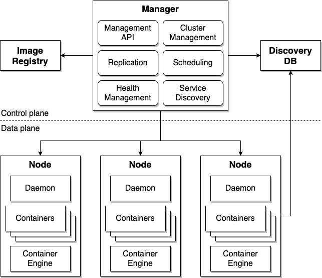

# Container Orchestrator

You are building a new application with a [*cloud native architecture*](README.md) that runs in [multiple containers](../Cloud-Native-DevOps/Container-Per-Service.md). Other applications have even more containers. You need a way to manage these containers and keep them running even while circumstances in the cloud keep changing.

**How can development teams manage the deployment, placement, and lifecycle of workload containers across multiple server computers?**

Deploying multiple containers seems simple: A container engine can run multiple containers, so run them all in there. But a container engine won't restart a failed container, doesn't replicate the container for high availability, doesn't help upgrade the container to a new version, and doesn't help client requests find the container. And a container engine only runs on a single server computer, which has limited capacity and is a single point of failure.

What you need is a container manager that coordinates container engines on multiuple server computers, distributes containers across those engines, manages the containers, and makes them available for clients to use. You need a manager that adjusts to changes in the cloud--such as a server failing--to keep the containers available.

Therefore,

**Install a _container orchestrator_ to create an environment for hosting large numbers of containers across multiple server computers.**

An installation of a container orchestrator is called a cluster. A cluster federates a dynamic set of hetrogeneous server computers and performs container orchestration. It has this general structure:

This cluster architecture consists of these components:
- **Manager**: The brains of the cluster, it manages the nodes and the containers running in the nodes. It runs six services that do much of the work:
  - **Management API**: Enables clients to direct the manager, such as to deploy an application
  - **Cluster management**: Adding and removing nodes, maintaining their configuration, and monitoring nodes
  - **Replication**: Decides when new containers need to be started and when ones not needed anymore should be stopped
  - **Scheduling**: Decides which node to start a new container on, striving to distribute replicas across the nodes and load balance the nodes
  - **Health management**: Detects and replaces unhealthy containers
  - **Service discovery**: Centralized lookup for services and the network addresses for the containers that provide the service
- **Image registry**: The database of container images that can be started on the nodes
- **Discovery DB**: Records the state of the cluster, such as which contianers are running on which nodes
- **Nodes**: The server computers that the containers run on. Each runs three types of processes:
  - **Daemon**: Agent that manages the containers in the node as directed by the manager
  - **Containers**: The processes running the application workloads
  - **Container engine**: The OS running the containers

The architecture forms two distinct layers, essentially the cluster's head and body:
- **Control plane**: Centralized management of the cluster
- **Data plane**: Capacity for running workloads, designed for horizontal scaling and high availability of the cluster itself

With this architecture, container orchestration handles responsibilities like deploying an application and enabling clients to access applications on the server.

The container orchestrator distributes responibilities for deploying an application amongst its services:
1. Cluster management determines the nodes available to host containers
1. Replication determines the containers to be started for the application
1. Scheduling determines which node to start each container on
   - It tells the node's daemon to start the container
1. The daemon starts the container in its container engine
1. Health management confirms each container is still running
   - When a container needs to be restarted, it tells scheduling

The container orchestrator likewise distributes responibilities for handling client requests amongst its services:
1. Service discovery derives state from the discovery DB as a catalog of services mapped to service providers
2. Service discovery routes each client request to a container that implements the service in one of the nodes

Interestingly, the container orchestrator architecture that originated with Cloud Foundry in 2011 and Kubernetes perfected in 2015 is quite similar to that of a WebSphere Application Server cell from 2002, where application servers run Java workloads instead of containers:
- **Deployment manager**: Centralized management of the cell
- **Nodes**: Server computers that scale horizontally
  - **Node agent**: Manages the node
  - **Applications**: Java (and eventually Node.js) workloads
  - **Application server**: The Java JVM/JRE with J2EE extensions

Examples of container orchestrators include:
- [**Kubernetes**](https://kubernetes.io/) (2015): The most widely used container orchestrator today. The project is managed by the [Cloud Native Computing Foundation](https://www.cncf.io/) (CNCF).
- [**Cloud Foundry**](https://docs.pivotal.io/pivotalcf/2-6/concepts/overview.html) (2011): Predecessor to Kubernetes, managed by Pivotal Software as part of the Cloud Foundry Foundation.
- [**Swarm**](https://docs.docker.com/engine/swarm/) (2015): A mode for managing multiple Docker Engines, managed by Docker, Inc.
- [**Mesos**](http://mesos.apache.org/) (2016) and [**Marathon**](https://mesosphere.github.io/marathon/) (2016): Server federation and container orchestration, managed by Apache and  Mesosphere respectively.

Each container being orchestrated is often running a [*microservice*](Microservice-Design.md) as a [*container per service*](../Cloud-Native-DevOps/Container-Per-Service.md). Containers support [*polyglot development*](../Microservices/Polyglot-Development.md) because each container runs its own language runtime, which can be any that runs in Linux.  The service in the manager that performs service discovery is acting as a [*service registry*](/Cloud-Native-DevOps/Service-Registry-kyle.md).

A [*service mesh*](Service-Mesh.md) such as Istio has a similar control plane/data plane architecture with multiple management services centralized in the control plane. Indeed, a service mesh such as Istio requires a container orchestrator because its capabilities depend greatly on the orchestrator's capabilities. A container orchestrator, particularly its service registry, greately simplifies implementing many [*Cloud Native DevOps*](../Cloud-Native-DevOps/README.md) techniques including [*red/black deploy*](../Cloud-Native-DevOps/Red-Black-Deploy.md), [*canary testing*](../Cloud-Native-DevOps/Canary-Testing.md), [*feature toggle*](../Cloud-Native-DevOps/Feature-Toggle.md), [*aggregating logs*](../Cloud-Native-DevOps/Log-Aggregator.md), and [*autoscaling*](../Cloud-Native-DevOps/Autoscale.md).

The [*CI/CD pipeline*](../Cloud-Native-DevOps/CD-Pipeline.md) and its [*container build pipeline*](../container-architecture/docker-build-pipeline.md) itself can run in the container orchestrator that it also deploys to.
